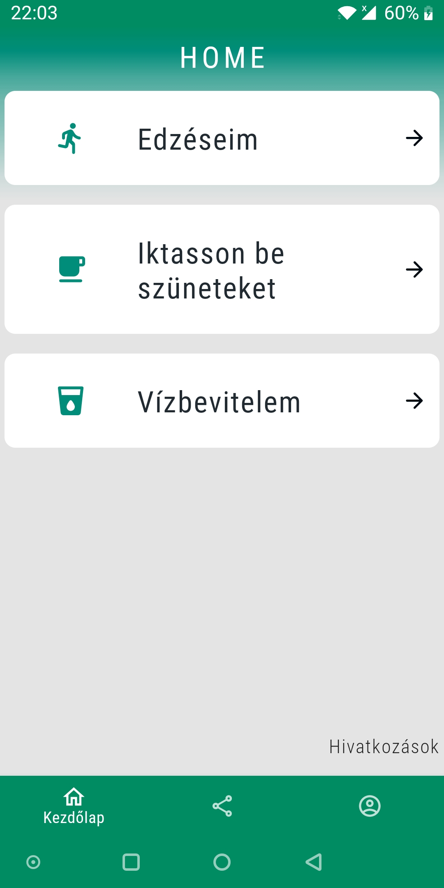
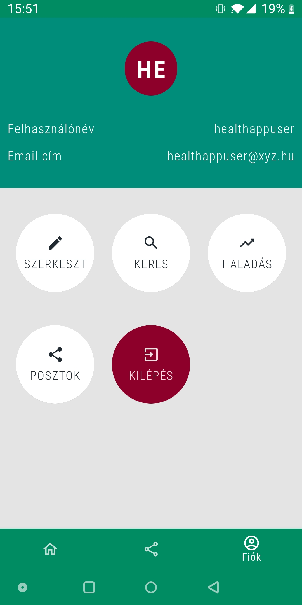
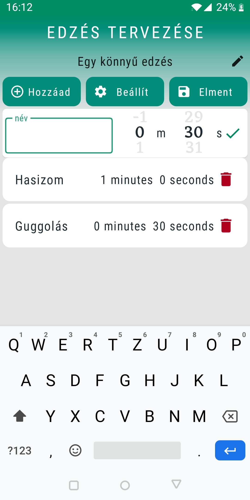
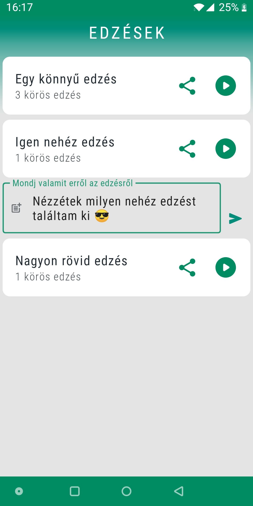
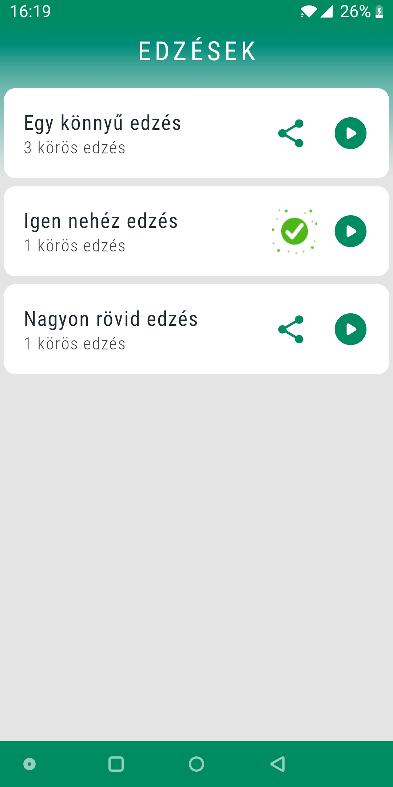
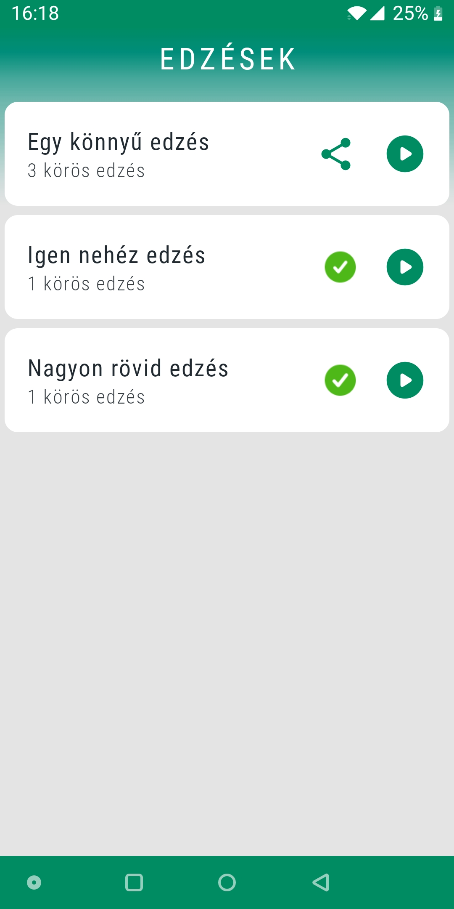
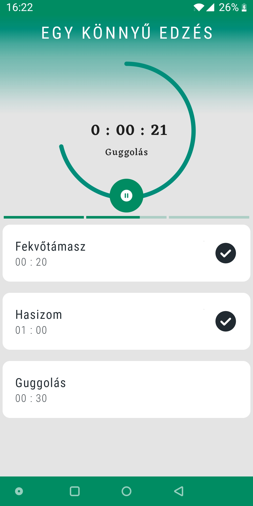
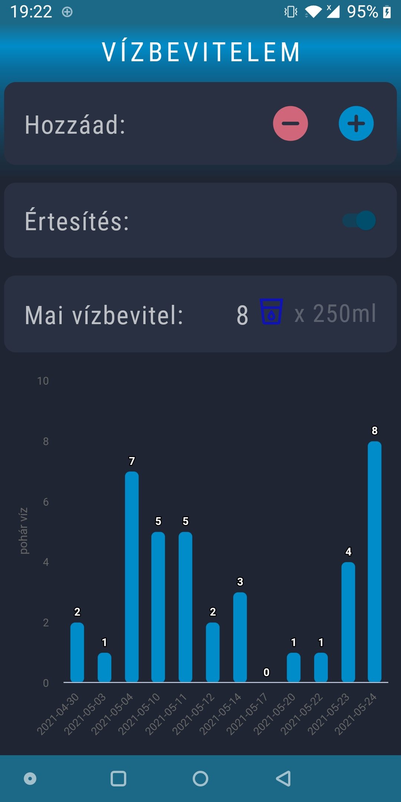

# HEALTH APP
<H2>Screenshots</H2>
A health focused social media app with Firebase integration, showcasing the use of Jetpack Compose, Compose navigation, Coroutines, Flow, LiveData, Dagger Hilt, MVVM, Paging 3
and other recent technologies.

<H3>Screenshots</H3>

Note: The screenshots do not cover the whole app.

 
 
 

 

